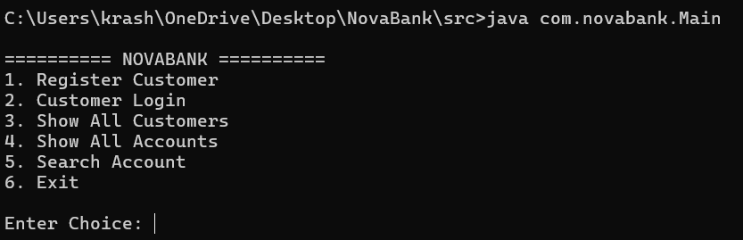
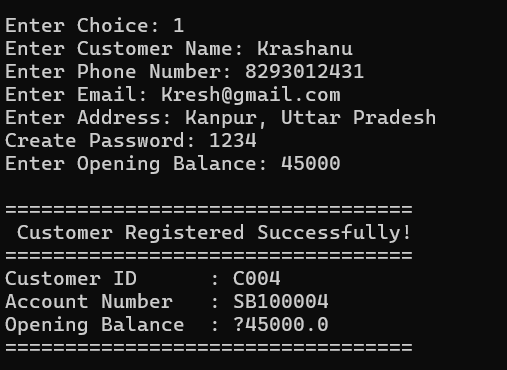
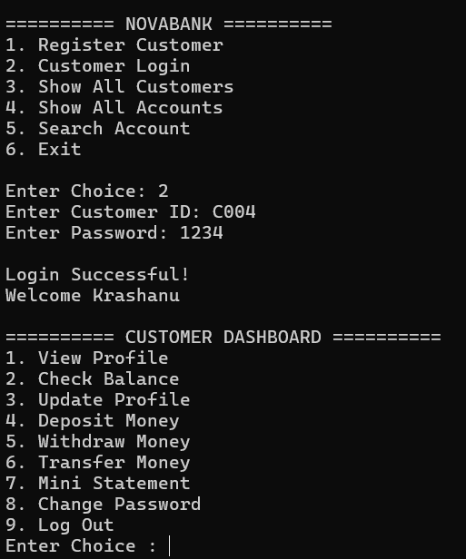
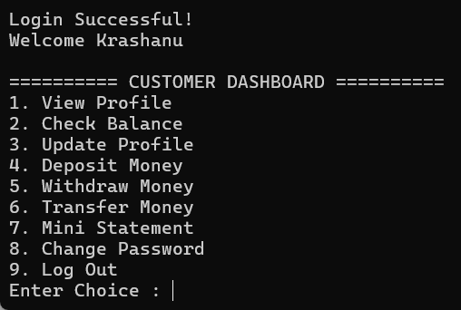
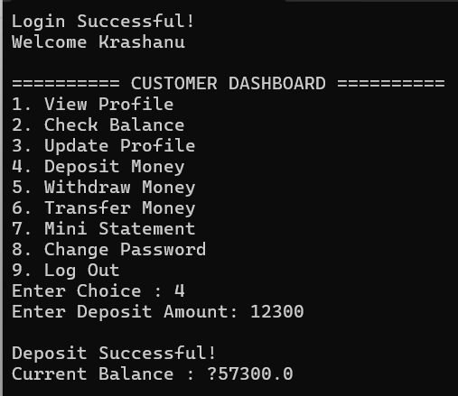
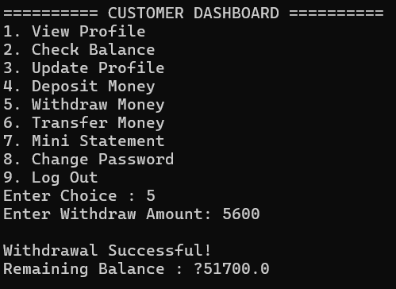
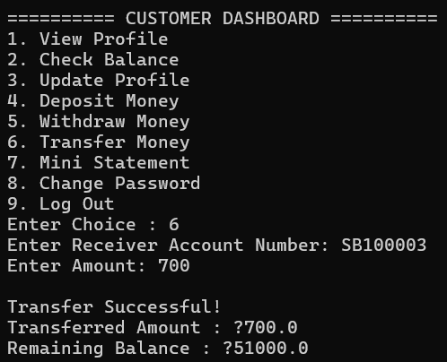
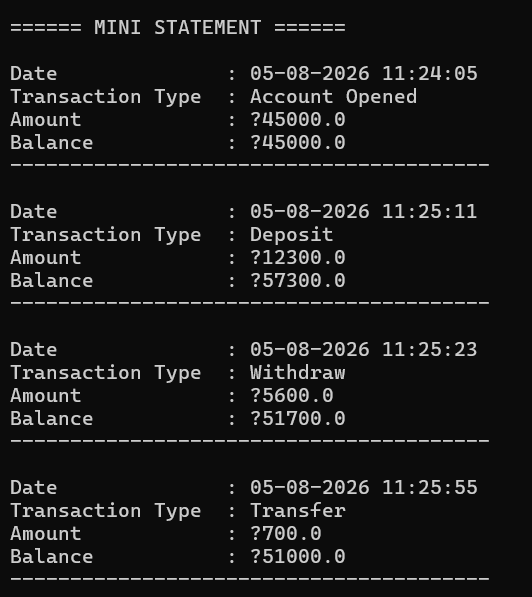
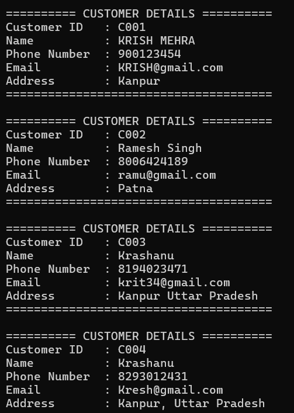
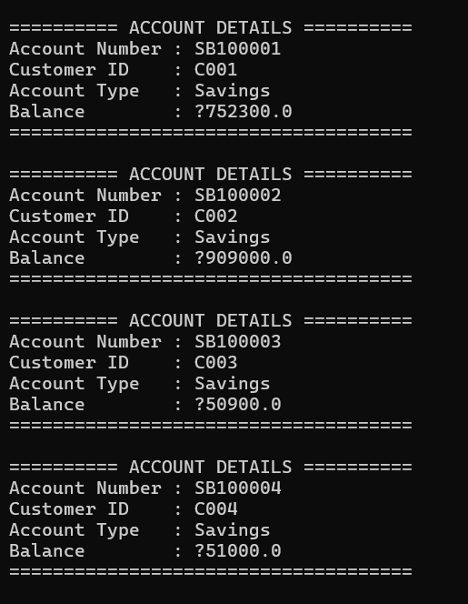

# 🏦 NovaBank - Banking Information System

A console-based **Banking Information System** developed using **Core Java** as part of a Java Development Internship. The project simulates the core functionalities of a real-world banking application by implementing secure customer management, account operations, transaction processing, and persistent data storage.

The primary objective of NovaBank is to provide a practical understanding of **Object-Oriented Programming (OOP)**, **Java Collections**, **File Handling**, **Serialization**, and **Exception Handling** through a modular and menu-driven banking application.

---

# 📖 Project Overview

NovaBank is designed as a prototype banking application that allows registered customers to perform essential banking operations through a console-based interface. The application follows a modular architecture using Java packages and demonstrates how different components of a banking system interact with each other.

The project maintains customer records, account information, and transaction history while ensuring data persistence using Java Serialization. Every operation performed by the customer is reflected immediately in the account balance and stored for future sessions.

This project was developed by following the Banking Information System problem statement provided during the Java Development Internship and focuses on implementing the core functionalities expected from a basic banking application.

---

# 🎯 Project Objectives

- Develop a modular banking application using Core Java.
- Apply Object-Oriented Programming principles in a real-world project.
- Implement secure customer registration and login.
- Manage customer accounts efficiently.
- Perform deposit, withdrawal, and fund transfer operations.
- Maintain transaction history using a mini statement.
- Store customer, account, and transaction data using Java Serialization.
- Handle invalid operations using exception handling.
- Organize the project using packages for better maintainability.
- Simulate the workflow of a basic banking management system.

---

# ✨ Key Features

NovaBank provides the following banking functionalities:

### 👤 Customer Management
- Customer Registration
- Secure Customer Login
- View Customer Profile
- Update Customer Profile
- Change Password

### 🏦 Banking Operations
- Deposit Money
- Withdraw Money
- Fund Transfer
- Check Account Balance
- Search Account

### 📄 Transaction Management
- Mini Statement
- Transaction History
- Remaining Balance Tracking

### 💾 Data Management
- Persistent Data Storage using Java Serialization
- Customer Records
- Account Records
- Transaction Records

### ⚠️ Exception Handling
- Invalid Login Credentials
- Insufficient Balance
- Invalid Transaction Amount
- Account Not Found
- Basic Input Validation

---

# 🛠️ Technologies Used

| Technology | Purpose |
|------------|---------|
| Core Java | Application Development |
| Object-Oriented Programming (OOP) | Software Design |
| Java Collections (ArrayList) | Data Storage During Execution |
| Java Serialization | Persistent Data Storage |
| File Handling | Read/Write Object Data |
| Exception Handling | Error Management |
| LocalDateTime API | Transaction Date & Time |
| Git & GitHub | Version Control |

---

# 📂 Project Structure

```text
NovaBank
│
├── src
│   ├── com
│   │   └── novabank
│   │       ├── model
│   │       ├── service
│   │       ├── storage
│   │       ├── util
│   │       ├── exception
│   │       └── Main.java
│   │
│   ├── accounts.dat
│   ├── customers.dat
│   └── transactions.dat
│
├── docs
│   ├── Screenshots
│   ├── Weekly Reports
│   ├── UML
│   └── Report_Content_Draft
│
├── README.md
└── .gitignore
```

---

# 📦 Packages

### 📁 model
Contains all entity classes used in the project.

- Customer
- Account
- Transaction
- Admin

---

### 📁 service

Contains the business logic of the Banking Information System.

- Customer Registration
- Login
- Deposit
- Withdrawal
- Fund Transfer
- Mini Statement
- Password Management

---

### 📁 storage

Responsible for data persistence using Java Serialization.

- DataStorage

---

### 📁 util

Contains helper classes.

- IdGenerator

---

### 📁 exception

Contains custom exception classes used for error handling.

---

# ▶️ Getting Started

## Prerequisites

Before running this project, make sure you have the following installed:

- Java JDK 23 or later
- Git (Optional)
- Visual Studio Code / IntelliJ IDEA / Eclipse

---

# 🚀 Installation

### 1. Clone the Repository

```bash
git clone https://github.com/krashanu6-sudo/NovaBank-Banking-Information-System.git
```

### 2. Open the Project

Open the project in your preferred Java IDE or Visual Studio Code.

---

### 3. Navigate to the Source Folder

```bash
cd src
```

---

### 4. Compile the Project

Windows CMD

```bash
dir /s /b *.java > sources.txt
javac @sources.txt
```

---

### 5. Run the Project

```bash
java com.novabank.Main
```

---

# 💻 Application Workflow

The application follows the workflow shown below:

```
Start Application
        │
        ▼
 Main Menu
        │
 ┌──────┴────────┐
 │               │
Register      Login
 │               │
 ▼               ▼
Customer Dashboard
 │
 ├── View Profile
 ├── Update Profile
 ├── Deposit
 ├── Withdraw
 ├── Transfer
 ├── Mini Statement
 ├── Change Password
 └── Logout
```

---

# 📊 Project Workflow

The NovaBank Banking Information System follows a modular workflow where customer information, account details, and transaction records are managed separately. The `BankService` class acts as the core business layer, coordinating all banking operations while the `DataStorage` class handles persistent storage using Java Serialization.

---

# 💾 Data Persistence

NovaBank stores application data locally using Java Serialization.

The following files are generated automatically during execution:

- `customers.dat`
- `accounts.dat`
- `transactions.dat`

These files ensure that customer records, account information, and transaction history remain available even after restarting the application.

---

# 📌 Current Status

| Feature | Status |
|----------|--------|
| Customer Registration | ✅ |
| Customer Login | ✅ |
| Account Management | ✅ |
| Deposit | ✅ |
| Withdrawal | ✅ |
| Fund Transfer | ✅ |
| Mini Statement | ✅ |
| Data Persistence | ✅ |
| Exception Handling | ✅ |

---

# 📈 Future Enhancements

Future improvements planned for NovaBank include:

- Spring Boot Integration
- MySQL Database Support
- RESTful APIs
- Graphical User Interface (JavaFX)
- Admin Dashboard
- Email Notifications
- Loan Management
- Interest Calculation
- ATM Simulation

---

# 📸 Project Screenshots

The following screenshots demonstrate the working of the NovaBank Banking Information System.

> **Note:** Screenshots will be added in future updates.

### Main Menu



---

### Customer Registration



---

### Customer Login



---

### Customer Dashboard



---

### Deposit Money




---

### Withdraw Money




---

### Fund Transfer




---

### Mini Statement




---

### Show Customers




---

### Show Accounts




---

# 🎓 Learning Outcomes

Through this project, I gained practical experience in:

- Core Java Programming
- Object-Oriented Programming (OOP)
- Java Packages
- Java Collections Framework
- File Handling
- Java Serialization
- Exception Handling
- Modular Software Development
- Git & GitHub Version Control
- Debugging and Problem Solving

---

# 🤝 Acknowledgement

This project was developed as part of my **Java Development Internship** to strengthen my understanding of Core Java and software development practices. The project follows the Banking Information System problem statement provided during the internship and focuses on implementing the essential functionalities of a banking application.

---

# 👨‍💻 Author

**Krashanu**

**B.Tech Computer Science & Engineering**

**World College of Technology and Management**

---

# ⭐ Support

If you found this project helpful, consider giving it a ⭐ on GitHub.

---

## 📌 Version

**NovaBank v1.0**

**Status:** ✅ Stable Release
